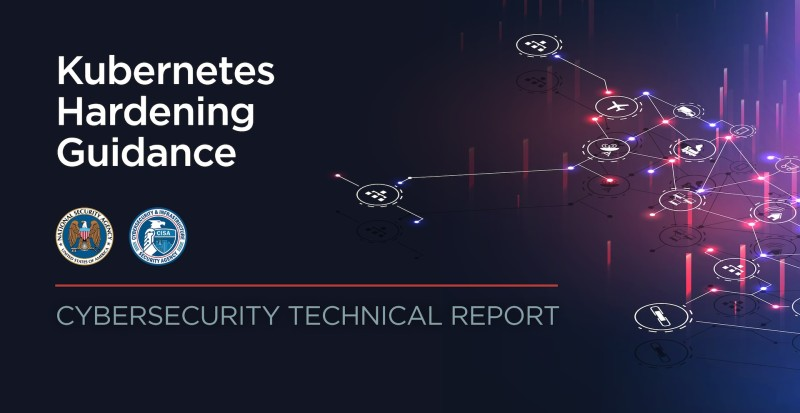

# "Kubernetes Hardening Guide"
*Kubernetes Hardening Guidance* [View the PDF](https://media.defense.gov/2022/Aug/29/2003066362/-1/-1/0/CTR_KUBERNETES_HARDENING_GUIDANCE_1.2_20220829.PDF) is provided by Released by the U.S. National Security Agency (NSA) in August 2022, see [publication information](publication-information.md) for details.

   

## License

You can share it using the [Attribution-NonCommercial-ShareAlike 4.0 (CC BY-NC-SA 4.0)](https://creativecommons.org/licenses/by-nc-sa/4.0/deed.en) license .
